# Mercado Express API

Checkpoint 4 — Parte 1 (API e Deploy)
FIAP — Curso de Tecnologia em Análise e Desenvolvimento de Sistemas (TDS)
Professor: Dr. Marcel Stefan Wagner

API REST para gerenciamento de produtos de um "mercado express", desenvolvida em **Spring Boot**, com persistência em **Oracle Database**, utilizando **Lombok** e seguindo o **Richardson Maturity Model nível 3 (HATEOAS)**.

## Integrantes

- Matheus Moya de Oliveira — RM 562822
- Luisa Ganasevici de Abreu — RM 563403
- Ana Carolina Pereira Fontes — RM 562145

**IDE utilizada:** IntelliJ IDEA

---

## Tecnologias utilizadas

| Tecnologia | Versão | Finalidade |
|---|---|---|
| Java | 21 (LTS) | Linguagem |
| Spring Boot | 4.1.0 | Framework principal |
| Maven | — | Gerenciador de dependências e build |
| Spring Web | — | Criação dos endpoints REST |
| Spring Data JPA | — | Persistência de dados via Hibernate |
| Spring HATEOAS | — | Implementação do nível 3 de maturidade REST |
| Lombok | — | Redução de código boilerplate (getters, setters, construtores) |
| Oracle Driver (JDBC) | — | Conexão com o banco de dados Oracle (ORACLE_FIAP) |
| springdoc-openapi | 3.1.0 | Documentação automática via Swagger UI |

---

## Arquitetura do projeto

O projeto segue a arquitetura em três camadas, com uma camada adicional de tratamento de exceções:

```
br.com.fiap.mercadoexpress
├── controller     -> Recebe requisições HTTP, monta as respostas com HATEOAS
├── service        -> Regras de negócio, orquestra o fluxo entre Controller e Repository
├── repository     -> Acesso a dados via Spring Data JPA
├── entity         -> Representação da tabela do banco de dados
└── exception      -> Tratamento centralizado de erros (ex: recurso não encontrado)
```

**Por que essa separação?** Cada camada tem uma única responsabilidade: o `Controller` não sabe nada sobre banco de dados, o `Service` não sabe nada sobre HTTP, e o `Repository` não sabe nada sobre regras de negócio. Isso reduz o acoplamento entre as partes do sistema — trocar o banco de dados, por exemplo, afetaria apenas a camada `Repository`.

O HATEOAS foi implementado especificamente na camada `Controller`, pois é ali que a API decide **como o recurso é exposto via HTTP** (rotas, links de navegação) — uma responsabilidade de comunicação/apresentação, não de regra de negócio.

---

## Modelagem da entidade `Mercado`

| Campo | Tipo Java | Coluna no Oracle | Observação |
|---|---|---|---|
| id | `Long` | Id | Gerado automaticamente via `SEQUENCE` do Oracle (`MERCADO_SEQ`), `allocationSize = 1` |
| nome | `String` | Nome | — |
| tipo | `String` | Tipo | — |
| setor | `String` | Setor | — |
| tamanho | `String` | Tamanho | — |
| preco | `BigDecimal` | Preco | `BigDecimal` em vez de `float`/`double`, para evitar erros de arredondamento em valores monetários |

**Estratégia de geração de ID:** optamos por `SEQUENCE` (em vez de `IDENTITY` ou `AUTO`) por ser a abordagem clássica do Oracle, com controle explícito via `@SequenceGenerator`. O `allocationSize = 1` garante que o Hibernate sempre consulte o valor real da sequence no banco antes de cada inserção — evitando conflitos de chave duplicada quando registros também são inseridos manualmente via SQL Developer.

---

## Configuração do banco de dados

A conexão com o Oracle (`ORACLE_FIAP`) é feita via `application.properties`, utilizando **variáveis de ambiente** para usuário e senha — nenhuma credencial fica exposta no repositório:

```properties
server.port=8082

spring.datasource.url=jdbc:oracle:thin:@oracle.fiap.com.br:1521:orcl
spring.datasource.username=${DB_USERNAME}
spring.datasource.password=${DB_PASSWORD}
spring.datasource.driver-class-name=oracle.jdbc.OracleDriver

spring.jpa.hibernate.ddl-auto=update
spring.jpa.show-sql=true
spring.jpa.properties.hibernate.dialect=org.hibernate.dialect.OracleDialect
```

Para rodar localmente, configure as variáveis de ambiente `DB_USERNAME` e `DB_PASSWORD` com suas credenciais do SQL Developer (via Run Configuration da IDE ou variáveis de sistema).

---

## O que é HATEOAS e por que foi usado

**HATEOAS** (Hypertext As The Engine Of Application State) é o princípio REST que define o **nível 3** do Modelo de Maturidade de Richardson — o nível mais alto da escala:

| Nível | Característica |
|---|---|
| 0 | Um único endpoint, tudo via POST |
| 1 | Múltiplos recursos com URIs próprias |
| 2 | Verbos HTTP corretos + status codes corretos |
| 3 | Nível 2 + **HATEOAS**: respostas incluem links de navegação |

Em vez de retornar apenas os dados do recurso, a API retorna também um campo `_links`, informando ao cliente quais ações/rotas estão disponíveis a partir daquele recurso — sem que o cliente precise conhecer essas URLs de antemão:

```json
{
  "id": 1,
  "nome": "Sabonete",
  "preco": 5.90,
  "_links": {
    "self": { "href": "http://localhost:8082/mercado/1" },
    "all-mercados": { "href": "http://localhost:8082/mercado" }
  }
}
```

Essa resposta é gerada com um `EntityModel<Mercado>`, que "embrulha" a entidade original com os links, sem alterar a classe `Mercado`. Os links são construídos de forma dinâmica com `linkTo(methodOn(...))`, apontando para os métodos reais do Controller — se uma rota mudar no futuro, o link se ajusta automaticamente.

---

## Endpoints

| Verbo | Rota | Descrição | Status de sucesso |
|---|---|---|---|
| GET | `/mercado` | Lista todos os produtos | 200 OK |
| GET | `/mercado/{id}` | Busca um produto por ID | 200 OK |
| POST | `/mercado` | Cria um novo produto | 201 Created |
| PUT | `/mercado/{id}` | Atualiza todos os campos de um produto | 200 OK |
| PATCH | `/mercado/{id}` | Atualiza parcialmente um produto (apenas os campos enviados) | 200 OK |
| DELETE | `/mercado/{id}` | Remove um produto pelo ID | 204 No Content |

### PUT vs PATCH

- **PUT**: substitui o recurso inteiro — o cliente deve enviar todos os campos.
- **PATCH**: atualiza apenas os campos enviados no corpo da requisição — os demais campos permanecem inalterados.

---

## Testes realizados (Postman) — porta `8082`

### 1. Configuração final do Spring Initializr

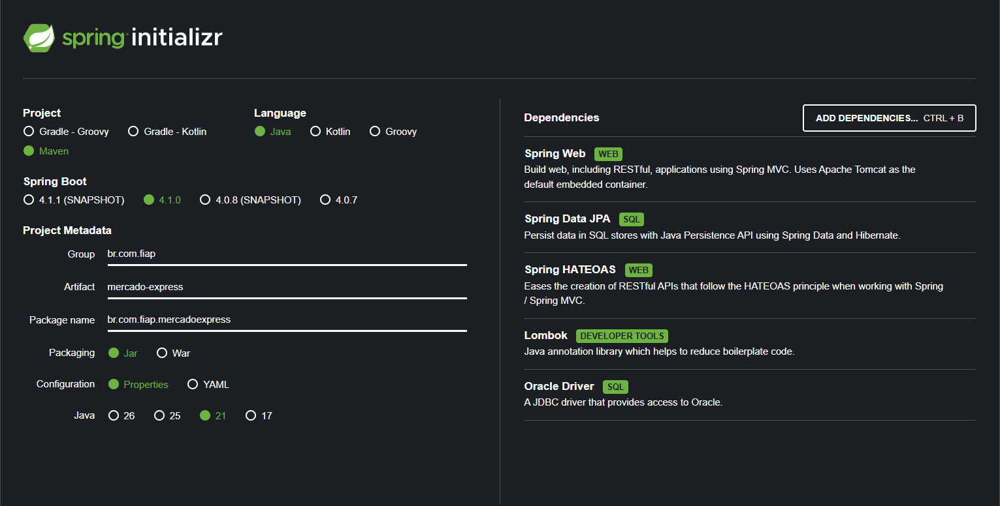

Configuração: Maven, Java 21, Spring Boot 4.1.0, com as dependências Spring Web, Spring Data JPA, Spring HATEOAS, Lombok e Oracle Driver.

### 2. GET /mercado — lista vazia

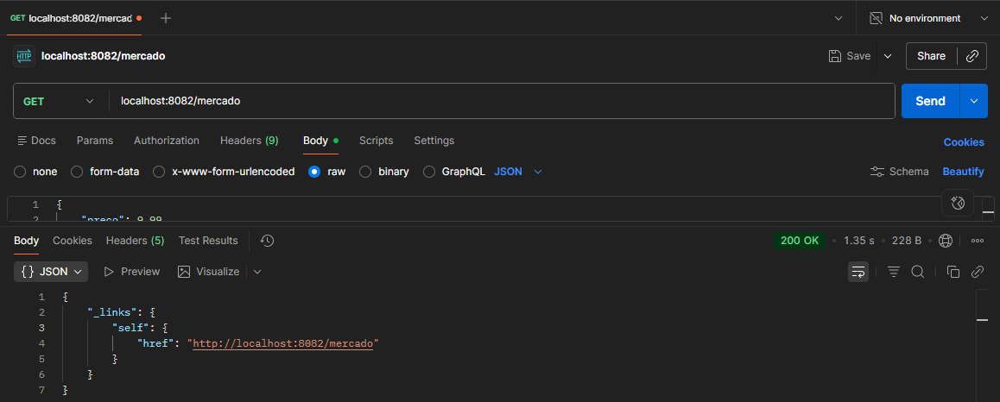

Sem registros na tabela, a API retorna apenas o link `self` da coleção, sem o campo `_embedded`.

### 3. POST /mercado — criação de produtos (Create)

Estrutura do JSON enviado:
```json
{
    "nome": "Sabonete",
    "tipo": "Limpeza",
    "setor": "A1",
    "tamanho": "P",
    "preco": 5.90
}
```


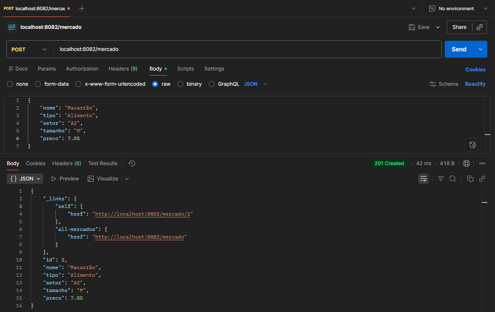


Cada criação retorna `201 Created`, com o header `Location` apontando para a URL do novo recurso e o corpo já contendo os `_links` do HATEOAS.

### 4. GET /mercado e GET /mercado/{id} — leitura (Read)

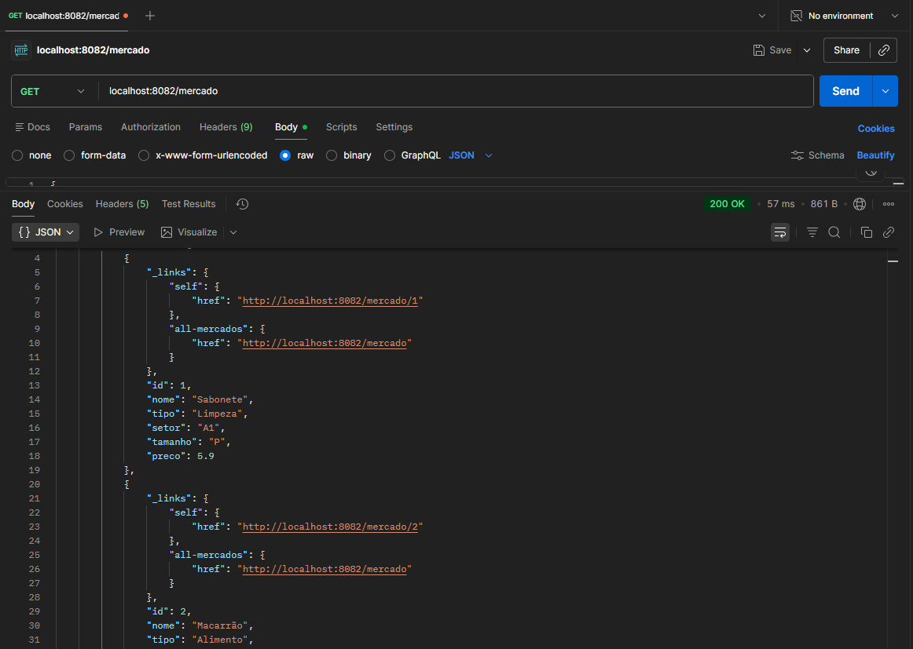


Com registros na tabela, a listagem geral passa a incluir `_embedded.mercadoList`, com cada item trazendo seus próprios `_links`.

### 5. GET /mercado/{id} inexistente — tratamento de erro

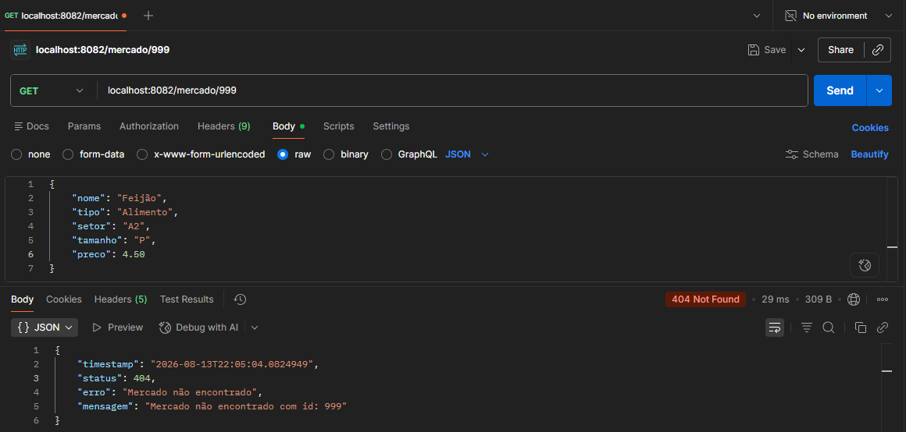

Ao buscar um ID que não existe, a API retorna `404 Not Found` com um corpo de erro estruturado, tratado pela classe `GlobalExceptionHandler`:
```json
{
    "timestamp": "...",
    "status": 404,
    "erro": "Mercado não encontrado",
    "mensagem": "Mercado não encontrado com id: 999"
}
```

### 6. PUT /mercado/{id} — atualização completa (Update)

Estrutura do JSON enviado (todos os campos):
```json
{
    "nome": "Sabonete Premium",
    "tipo": "Limpeza",
    "setor": "B2",
    "tamanho": "M",
    "preco": 8.50
}
```

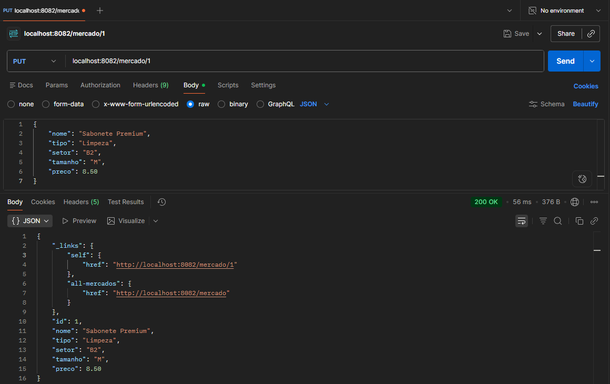
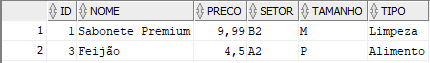

Todos os campos do registro foram substituídos, confirmado tanto na resposta da API quanto diretamente no SQL Developer.

### 7. PATCH /mercado/{id} — atualização parcial (Update)

Estrutura do JSON enviado (apenas o campo alterado):
```json
{
    "preco": 9.99
}
```

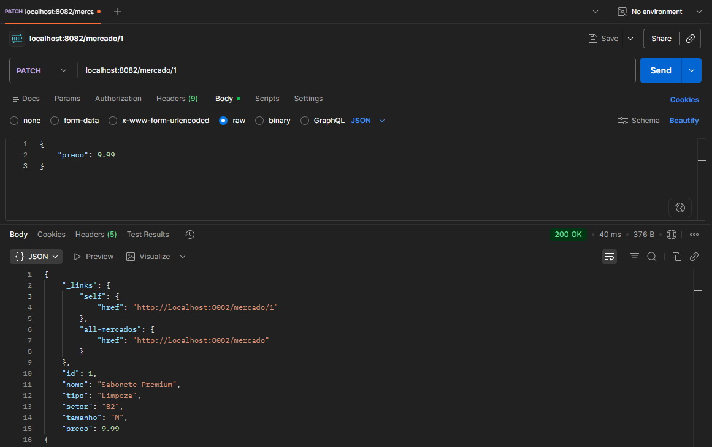

Apenas o campo `preco` foi alterado — `nome`, `tipo`, `setor` e `tamanho` permaneceram exatamente como estavam após o PUT, demonstrando a diferença de comportamento entre os dois verbos.

### 8. DELETE /mercado/{id} — exclusão (Delete)

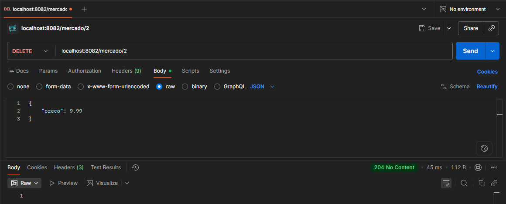
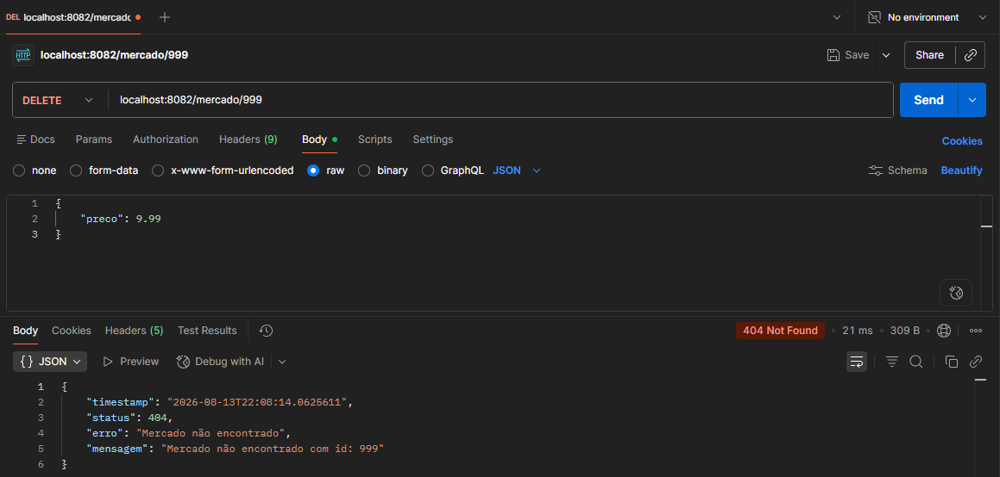
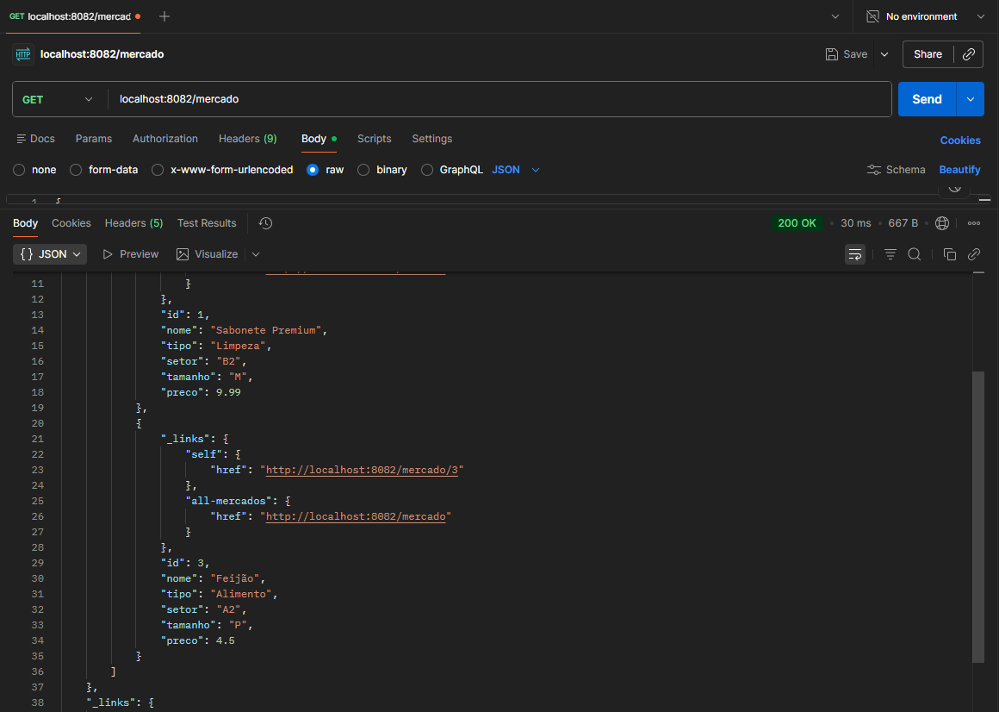

A exclusão de um ID existente retorna `204 No Content`, sem corpo de resposta. A exclusão de um ID inexistente é tratada pelo mesmo mecanismo de erro do GET, retornando `404 Not Found`. O GET final confirma que o registro excluído não aparece mais na listagem.

### 9. Swagger UI

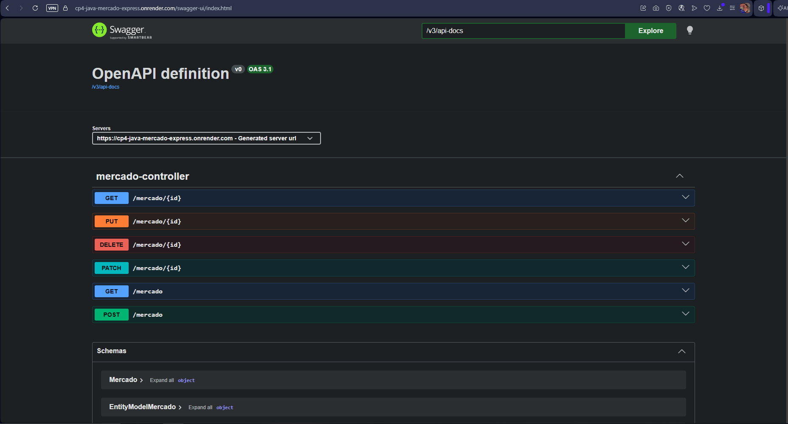

Documentação automática dos endpoints, gerada via `springdoc-openapi`, disponível em `/swagger-ui/index.html`.

---

## Como executar o projeto localmente

1. Clone o repositório
2. Configure as variáveis de ambiente `DB_USERNAME` e `DB_PASSWORD` com suas credenciais do Oracle FIAP
3. Execute a classe `MercadoExpressApplication`
4. A aplicação sobe em `http://localhost:8082`
5. Importe os endpoints no Postman/Insomnia usando a base `http://localhost:8082/mercado`

---

## Deploy

🔗 Link da aplicação em produção (Render): https://cp4-java-mercado-express.onrender.com

Deploy realizado via **Docker** (Render não possui runtime nativo para Java), com um `Dockerfile` multi-stage: a primeira etapa compila o projeto com Maven, a segunda roda apenas o `.jar` final sobre uma imagem JRE enxuta.

**Observações sobre o ambiente de produção:**
- O plano utilizado é o **Free Tier** do Render, que hiberna a aplicação após períodos de inatividade — a primeira requisição após esse período pode demorar cerca de 1 minuto para responder, enquanto a instância "acorda".
- O tamanho do pool de conexões do Hikari (`spring.datasource.hikari.maximum-pool-size`) foi reduzido explicitamente para respeitar o limite de sessões simultâneas (`SESSIONS_PER_USER`) da conta acadêmica no Oracle da FIAP.
- Um endpoint `GET /` foi criado para servir como página inicial da API, retornando informações do projeto e um link HATEOAS para o recurso principal (`/mercado`) — reforçando o próprio princípio de navegabilidade da API já na porta de entrada.

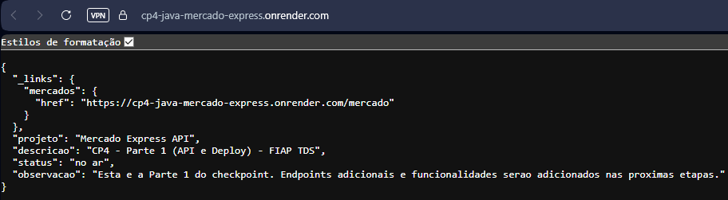

---

## Estrutura de commits

O projeto seguiu a convenção de **Conventional Commits** (`feat:`, `fix:`, `chore:`, `docs:`), documentando de forma clara a evolução do desenvolvimento — desde a configuração inicial até a implementação completa do CRUD com HATEOAS.